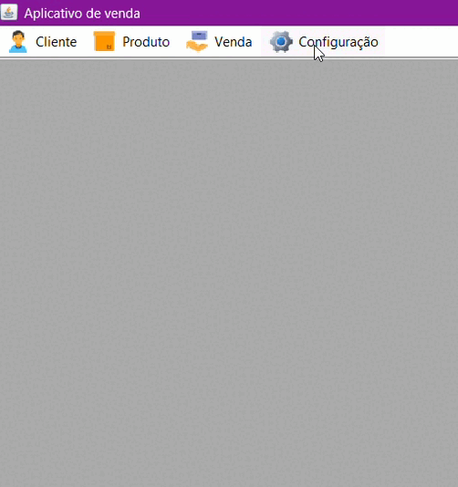

# Aplicativo de venda (Teste VR)
Aplicativo feito em Java com Swing para gerenciamento de vendas, produtos e clientes.

## ⚙️ Configurações

### 🎲 Banco de dados

#### Opção 1. Via [Docker](https://www.docker.com/products/docker-desktop/) compose
Na pasta raiz do projeto ha um arquivo <strong>docker-compose.yml</strong>, abra o terminal nesse caminho e execute o comando:

```docker compose up```

Isso fará com que o banco de dados já montado inicie.

#### Opção 2. Via Projeto
No menu inicial na parte superior há um menu chamado <strong>Configuração</strong> ao clicar nele abrirá uma janela com a opção de criar as tabelas do banco de dados.



### 💻 Variaveis de ambiente
Na pasta raiz do projeto há um arquivo <strong>config.properties</strong>, nesse arquivo é aonde que ficam as configuraões de conexão com o banco de dados.

## 📖 Especificações
### Versões
 - Java JDK 18.0.2.1
 - PostreSQL 16.2